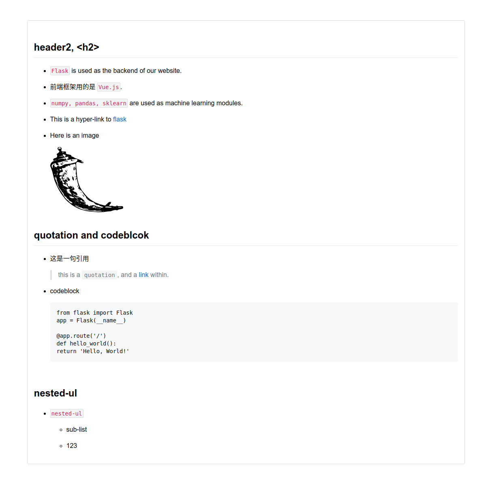

##  Description

This is a github-flavored markdown parser. 利用该程序，可以将 `readme.md` 解析成为 `html` 文件, 方便展示和打印。

All html tags, e.g. `<h1>`, `<a>`, `<p>`, will be escaped unless there is only a `<br>` in a line, which could be used to add more space between two sections).

<br>

##  Usage

Install python3, then run the following command

```python
python3 mdparser.py [blog.md]
```

<br>

##  Demo

*   Here is a demo `markdown` text [blog.md](./demo/blog.md), and its corresponding html text [blog.html](./demo/blog.html) would be like this

    

<br>

##  TODO

*   Colored codeblock highlight, 代码颜色高亮仍待实现

*   ordered list, `ol`, 有序列表

*   a formal specification

##  Reference

*   [GitHub Developer REST API v3](https://developer.github.com/v3/markdown/#render-an-arbitrary-markdown-document)

*   [GitHub Flavored Markdown Spec](https://github.github.com/gfm/)
